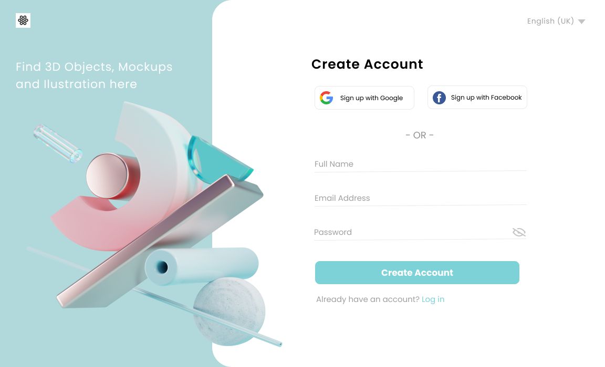

# Projeto Flutter: Desafio de design

Este desafio consiste em um página de registro responsivo para web/desktop e mobile.

## Protótipo

## Resultado Final

## Requisitos

Para executar este projeto, é necessário ter o seguinte software instalado:

- [Flutter](https://flutter.dev/docs/get-started/install)

## Como executar

1. Clone este repositório usando o seguinte comando:
   `git clone https://github.com/ElioGaldino3/design_challenges.git`
2. Entre na pasta do projeto
   `cd design_challenges/sign_up_01`
3. Baixe as bibliotecas necessárias
   `flutter pub get`
4. Conecte um dispositivo móvel ou execute um emulador.
5. Execute o comando `flutter run` no terminal.

## Resultado

Ao executar o projeto, será exibida a tela de cadastro. Você pode redimesionar a tela para ver a responsividade funcionando.

## Conclusão

Este projeto tem alguns pontos importantes:

- Utilização de assets
- Manipulação de imagens
- Responsividade
- Customização de componente através do "theme"
- Validação de formulário